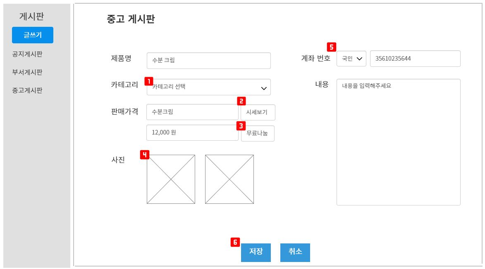

# 목차

- [목차](#목차)
- [1. 프로젝트 설명](#1-프로젝트-설명)
  - [1.1. 프로젝트 기간](#11-프로젝트-기간)
  - [1.2. 프로젝트 명](#12-프로젝트-명)
  - [1.3. 프로젝트 인원](#13-프로젝트-인원)
  - [1.4. 주제 선정 이유](#14-주제-선정-이유)
  - [1.5. 개발환경](#15-개발환경)
  - [1.6. ERD모델](#16-erd모델)
  - [1.7. 구현 기능](#17-구현-기능)
  - [1.8. 담당 역할](#18-담당-역할)
  - [1.9. 파이널 프로젝트 후기](#19-파이널-프로젝트-후기)
- [2. 화면 설계](#2-화면-설계)
  - [2.1. 게시물 등록화면](#21-게시물-등록화면)
  - [2.2. 시세검색](#22-시세검색)
  - [2.3. 게시물 조회화면](#23-게시물-조회화면)
  - [2.4. 찜목록](#24-찜목록)
  - [2.5. 게시물 상세화면](#25-게시물-상세화면)
  - [2.6. 계좌 보기](#26-계좌-보기)
- [3. 기능 구현](#3-기능-구현)
  - [3.1. 게시물 등록](#31-게시물-등록)
    - [3.1.1. 기본 등록화면](#311-기본-등록화면)
    - [3.1.2. 사진미리보기 및 삭제](#312-사진미리보기-및-삭제)
    - [3.1.3. 시세검색 화면](#313-시세검색-화면)
  - [3.2. 더블마켓(중고시장) 메인화면](#32-더블마켓중고시장-메인화면)
    - [3.2.1. 기본 페이징화면](#321-기본-페이징화면)
    - [3.2.2. 검색 및 정렬 화면](#322-검색-및-정렬-화면)
  - [3.2. 게시물 상세화면](#32-게시물-상세화면)
    - [3.2.1. 상세페이지](#321-상세페이지)
    - [3.2.2. 조회수기능](#322-조회수기능)
  - [3.2. 게시물 수정](#32-게시물-수정)
  - [3.3. 게시물 삭제](#33-게시물-삭제)
  - [3.4. 찜 (관심상품)](#34-찜-관심상품)
  - [3.5. 시세 검색](#35-시세-검색)
  - [3.6. 댓글](#36-댓글)
    - [3.6.1. 댓글 등록](#361-댓글-등록)
    - [3.6.2. 댓글 수정](#362-댓글-수정)
    - [3.6.3. 댓글 삭제](#363-댓글-삭제)

# 1. 프로젝트 설명

## 1.1. 프로젝트 기간
2020년 01월 27일 ~ 2021년 03월 4일
  

## 1.2. 프로젝트 명
DoubleU 그룹웨어
  

## 1.3. 프로젝트 인원
6명
  

## 1.4. 주제 선정 이유
각 모듈별로 기능이 뚜렷하고 직원들이 커뮤니케이션 가능한 그룹웨어를 만들고 싶었다
  

## 1.5. 개발환경
- Language : Java  
- DBMS : Oracle11g  
- Prontend : HTML, CSS, javascript  
- Library : Jquery, ojdbc, mybatis, JSTL, cos  
- Framework : MyBatis, bootstrap, spring boot, ajax  
- Server : Apache Tomcat 9.0  
- Control : GitHub, SourceTree  
- IDE : Eclipse, SQL Developer, VS Code  
  

## 1.6. ERD모델

## 1.7. 구현 기능

- 회원관리
  - 로그인, 로그아웃, 마이페이지

- 게시판
  - 공지사항, 경조사게시판, 중고시장, 메일함, 전자결재, 일정관리, 프로필, 조직도, 근태관리
## 1.8. 담당 역할
`중고게시판 `  
- 게시물 등록, 조회, 수정, 삭제 
- 카테고리별 검색 및 정렬
- 무료나눔, 시세확인, 다중파일 업로드 및 미리보기
- 페이징 처리 및 조회수
- 게시물작성 후로부터 현재까지 시간 구현
- 찜하기, 찜목록
- 시세 검색 및 작성글 검색
- 댓글 등록, 조회, 수정, 삭제
- 낮은 가격순, 최신순 정렬
- 다중사진 슬라이드로 출력 

  

## 1.9. 파이널 프로젝트 후기
세미프로젝트 때 아쉬웠던 점을 많이 만회하였다. 중고게시판내에서 기능들을 확장할 수 있었으며 세미 때 결함이 있었던 정렬부분도 새로 보완할 수 있었다. 특히 파일 업로드부분이 많이 어려웠는데 메인화면, 상세화면에 각각 사진을 다르게 출력하고 많은 에러를 겪으며 발전할 수 있었다. 또한 화면설계와 DB설계에 보다 많은 시간을 투자하였다. 카카오오븐으로 와이어프레임을 만들고 스토리보드로 구체적인 흐름을 설계하였다.  개발완료 후에 설계화면을 보니 거의 90%정도가 흡사하여 설계의 중요성을 다시 한 번 느꼈다. 

  

# 2. 화면 설계

## 2.1. 게시물 등록화면

- 카테고리 선택가능
- 시세보기 창이 팝업창으로 뜨며 검색이 가능하다
- 무료나눔을 클릭하면 0원으로 처리가 된다
- 사진을 다중으로 업로드가 가능하다
 

    

## 2.2. 시세검색

- 상품을 입력하면 그래프가 출력
- 상품의 평균가격을 출력

    

## 2.3. 게시물 조회화면

- 찜 목록 버튼을 누르면 찜리스트 출력
- 시세확인 버튼을 누르면 시세확인 창으로 넘어간다
- 카테고리별 및 상품별 검색이 가능하다
- 전체 글 갯수를 출력
- 최신순, 낮은 가격순 정렬 가능
- 게시물은 사진, 상품명, 가격, 찜, 작성자로 구성
- 페이징 가능

    

## 2.4. 찜목록 

- 찜목록을 누르면 모달창으로 리스트가 뜸
- 리스트를 클릭하면 상품의 상세페이지로 이동
- 스크롤로 리스트를 볼 수 있다
 
    

## 2.5. 게시물 상세화면

- 카테고리, 작성자, 날짜, 조회수는 테이블형식으로 출력
- 제품명,가격, 찜을 볼 수 있다
- 계좌보기를 누르면 계좌모달창이 뜬다
- 댓글 등록, 수정, 삭제, 조회가 가능하다

    

## 2.6. 계좌 보기

- 계좌번호와 이름이 각각 모달창으로 출력

    

# 3. 기능 구현

## 3.1. 게시물 등록

### 3.1.1. 기본 등록화면

- 무료나눔 시 모달창이 뜨며 가격은 0원으로 자동수정된다
- 사진등록은 최대 5장 가능하며 그 이상 첨부 시 경고모달창이 뜬다
  
    

### 3.1.2. 사진미리보기 및 삭제

- 사진등록시 미리보기가 가능하며 삭제하고 다시 첨부가 가능하다

    

### 3.1.3. 시세검색 화면

- 시세검색 버튼 클릭 시 시세 검색팝업창이 뜬다
  - 검색결과가 없으면 다시 입력해달라는 메시지를 출력한다
  - 검색어의 가격 및 평균시세를 출력해준다

    

## 3.2. 더블마켓(중고시장) 메인화면
### 3.2.1. 기본 페이징화면

    

### 3.2.2. 검색 및 정렬 화면

- 카테고리 및 상품명으로 검색이 가능하다
- 검색된 글 갯수를 출력 및 페이징 처리
- 검색 결과에 따른 정렬도 가능하다

    

## 3.2. 게시물 상세화면

### 3.2.1. 상세페이지

- 게시물 작성시간이 몇 분전인지 확인가능
- 사진을 슬라이드형식으로 볼 수 있다
- 계좌보기 버튼 클릭 시 판매자의 계좌가 뜬다
- 본인 게시물의 경우에만 수정, 삭제 버튼이 활성화된다

    

### 3.2.2. 조회수기능

- 조회할 때마다 조회수가 증가한다

    

## 3.2. 게시물 수정

- 사진 수정 및 게시물 내용 수정이 가능하다
- 수정한 게시물은 제일 상단에 노출이 된다

    

## 3.3. 게시물 삭제

- 삭제 버튼 클릭 시 모달창이 뜨며 삭제 시 메인화면으로 이동한다

    

## 3.4. 찜 (관심상품)

- 찜목록 버튼 클릭시 모달창으로 찜한 상품들이 뜬다
  - 간단히 상품명과 가격만 출력된다
- 빈하트를 누르면 찜목록에 추가되며 다시 클릭시에는 찜목록에서 사라진다
- 찜목록 모달창에서 상품을 클릭하면 해당 게시물로 이동한다

    

## 3.5. 시세 검색

- 메인에서 시세검색 버튼을 클릭하면 시세버튼 페이지로 이동한다
- 올바르지 않은 검색어 일시 경고문이 뜬다
- 올바른 상품명 입력시 시세그래프와 평균시세를 출력한다
- 아래 상품보기 버튼 클릭 시 해당 상품목록 페이지로 이동한다

    

## 3.6. 댓글

### 3.6.1. 댓글 등록

- 작성자의 댓글은 색깔을 변경시켜주어 구분이 쉽게 하였다

    

### 3.6.2. 댓글 수정

- 본인이 쓴 댓글일 때만 댓글의 수정, 삭제 버튼이 활성화된다
- 수정 시 모달창이 뜨며 모달창에서 수정이 가능하다

    

### 3.6.3. 댓글 삭제

- 해당 댓글작성자만이 삭제가 가능하다

    
