# 목차

- [목차](#목차)
- [1. 프로젝트 설명](#1-프로젝트-설명)
  - [1.1. 프로젝트 기간](#11-프로젝트-기간)
  - [1.2. 프로젝트 명](#12-프로젝트-명)
  - [1.3. 프로젝트 인원](#13-프로젝트-인원)
  - [1.4. 주제 선정 이유](#14-주제-선정-이유)
  - [1.5. 차별성](#15-차별성)
  - [1.6. 개발환경](#16-개발환경)
  - [1.7. ERD 모델](#17-erd-모델)
  - [1.8. 구현기능](#18-구현기능)
  - [1.9. 담당역할](#19-담당역할)
  - [1.9. 세미 프로젝트 후기](#19-세미-프로젝트-후기)
- [2. 기능 구현](#2-기능-구현)
  - [2.1.1 메인페이지](#211-메인페이지)
  - [2.1.2. 헤더](#212-헤더)
  - [2.1.3. 상품 진열](#213-상품-진열)
  - [2.1.4. 상품 검색](#214-상품-검색)
  - [2.1.5. 상품 정렬](#215-상품-정렬)
  - [2.1.6. 공지 팝업창](#216-공지-팝업창)
  - [2.2.1. 로그인](#221-로그인)
  - [2.2.2. 로그아웃](#222-로그아웃)
  - [2.2.3. 아이디찾기](#223-아이디찾기)
  - [2.2.4. 비밀번호 찾기](#224-비밀번호-찾기)
  - [2.2.5. 카카오로 로그인하기](#225-카카오로-로그인하기)
  - [2.3.1. 카카오페이 API로 결제하기](#231-카카오페이-api로-결제하기)
  - [2.3.2. 에디터 API로 글쓰기](#232-에디터-api로-글쓰기)
  - [2.3.3. 채팅 API로 실시간 문의하기](#233-채팅-api로-실시간-문의하기)
  - [2.4.1. 공지사항 게시판](#241-공지사항-게시판)
  - [2.4.2. 이벤트 게시판](#242-이벤트-게시판)
  - [2.5. 관리자 페이지](#25-관리자-페이지)
  - [2.6.1. 로고 이미지](#261-로고-이미지)
  - [2.6.2. 광고 이미지](#262-광고-이미지)

# 1. 프로젝트 설명
## 1.1. 프로젝트 기간  
 2020.12.01~ 2020.01.12
    

## 1.2. 프로젝트 명 
FineApple (전자제품 판매쇼핑몰)
    

## 1.3. 프로젝트 인원 
6명

    

## 1.4. 주제 선정 이유 
팀원들 대부분이 가장 무난하고도 배운 내용을 복습할 수 있는 프로젝트는 쇼핑몰이라고 생각했다. 쇼핑몰은 무난하지만 기능을 얼마나 추가하냐에 따라서 난이도가 높아질 수도 있기때문에 최소기능 구현 후에는 추가작업을 하려고 했다
    

## 1.5. 차별성
- 가독성과 접근성
    - 쇼핑몰에서 상품의 질과 가격도 중요하지만 접근성과 가독성도 무척 중요하다. 따라서 직관적이고 심플한 UI/UX를 구축하였고 다양한 기능들을 추가했다.   
  `헤더에 상품 검색 기능, 사이트 맵, 메뉴 드롭다운 시 서브메뉴, 게시판 마다 있는 바로가기키`
    
- 커뮤니케이션
  - 고객과의 소통을 중요시하며 단방향이 아닌 양방향성의 의사소통을 할 수 있도록 하였다  
  `실시간 문의, 다양한 커뮤니티 게시판`

- 편리성
  - 간단하고 편리하게 시스템을 이용할 수 있는 기능들을 추가했다  
  `카카오페이 API, 카카오 로그인 API, 에디터 API`

   
 
## 1.6. 개발환경
- Language : Java
- DBMS : Oracle11g
- Prontend : HTML, CSS, javascript, jstp/servlet
- Library : Jquery, ojdbc, mybatis, JSTL, cos
- Framework : MyBatis
- Server : Apache Tomca 9.0
- Control : GitHub, SourceTree
- IDE : Eclipse, SQL Developer, VS Code

   

## 1.7. ERD 모델
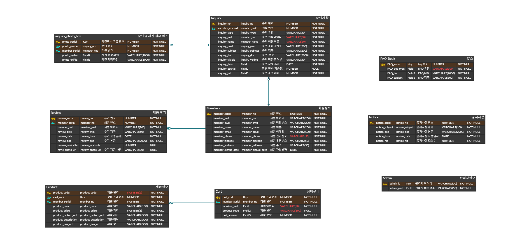

  
  

## 1.8. 구현기능
- 회원기능
   - 회원가입, 로그인, 아이디/비밀번호 찾기, 마이페이지, 정보 수정, 주문내역, 장바구니
- 게시판
   - 문의게시판, 이벤트, 공지사항, 리뷰게시판
- API
   - 카카오 로그인API, 에디터 API, 채팅API, 카카오 결제 API
- 메인
     - 상품진열, 상품검색, 상품정렬
- 관리자 페이지
   - 상품목록, 회원목록, 매출달력

  

## 1.9. 담당역할
[메인페이지](#211-메인페이지), [로고디자인](#261-로고-이미지), [상품 진열](#213-상품-진열)/ [상품 검색](#214-상품-검색)/ [상품 정렬](#215-상품-정렬), [로그인](#221-로그인), [아이디 찾기](#223-아이디찾기)/ [비밀번호 찾기](#224-비밀번호-찾기), [공지 팝업창](#216-공지-팝업창), [이벤트게시판](#242-이벤트-게시판), [공지게시판 등록/검색/삭제](#241-공지사항-게시판) , [채팅 API](#233-채팅-api로-실시간-문의하기), [에디터 API](#232-에디터-api로-글쓰기), [카카오 로그인 API](#225-카카오로-로그인하기), [카카오 결제 API](#231-카카오페이-api로-결제하기), [관리자 페이지](#25-관리자-페이지), DB모델링 및 연동, PPT제작 등

    

## 1.9. 세미 프로젝트 후기

아쉬웠던 부분은 크게 두 가지다. 첫 번째는 완성도이고 두 번째는 설계다.
처음 하는 프로젝트이다 보니 욕심이 나서 다양한 기능들을 구현을 하고 싶었다. 그래서 원래 맡았던 부분에 대한 기능 확장보다는 다른 기능들을 넣었다. 덕분에 홈페이지의 기능은 풍부해졌지만 완성도는 조금 떨어졌다 . 따라서 다음 프로젝트에는 하나의 모듈이라도 완성도 있게 기능을 확장하는 측면으로 하기로 다짐했다.
두 번째로 아쉬웠던 점은 설계를 탄탄히 하지 못한 점이다. 화면설계를 제대로 안해 놓으니 매번 프론트를 바꿔야했고 스토리보드가 없으니 진행과정에서 난항을 겪기도 하였다. DB의 테이블과 컬럼도 수도없이 수정을 했다. 이를 통해 설계는 정말 중요한 것이라고 생각을 하였습니다. 
설계가 탄탄하면 개발에 걸리는 시간을 줄일 수 있기 때문에 설계하는 시간에 투자를 아끼지 않기로 다짐했던 계기가 되었다. 
      

# 2. 기능 구현

## 2.1.1 메인페이지

-  헤더: 검색, 로고, 메뉴에 댔을 때 서브메뉴 드롭다운
-  메인이미지 슬라이드
-  메인문구 슬라이드
-  카테고리별 Ajax로 상품진열, 상품정렬
-  푸터: 사이트맵
   -  다른 팀원이 하신 부분이다
-  채팅API로 바로 문의 가능
      

## 2.1.2. 헤더

-   로그인 전, 회원가입과 로그인이 뜨도록

-   로그인 후, 마이룸과 로그아웃이 뜨도록
      

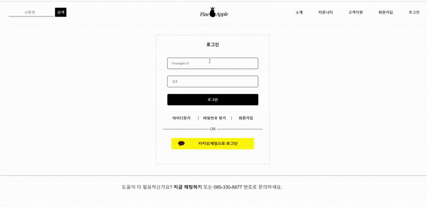

-   관리자 로그인 후, 관리자페이지와 로그아웃 뜨도록
      

-   메뉴 드롭다운 시 서브메뉴 나오도록

      
   
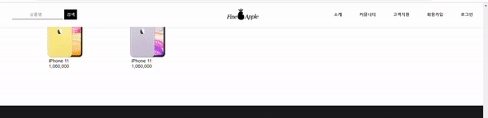

-   헤더는 픽스가 가능하도록 설정
    -   스크롤을 내려도 헤더는 고정되어있다
      

## 2.1.3. 상품 진열
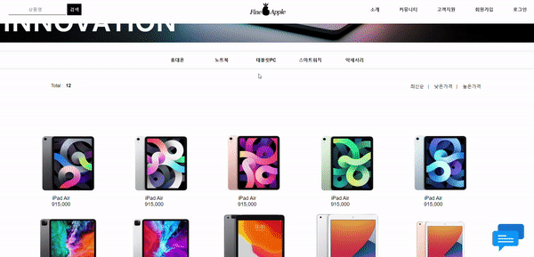

- 홈페이지를 클릭하면 바로 상품을 볼 수 있게 메인에 상품배치
- Ajax를 활용하여 페이지전체새로고침없이 상품부분만 새로고침되도록
- 상품에 마우스를 댔을 때 희미해지며 더알아보기뜨도록
      

## 2.1.4. 상품 검색

- 헤더에 배치하여 어디에서든 상품을 검색할 수 있도록 하였다
- 검색을 하면 검색페이지로 이동한다
  - 상품명으로 검색이 가능하고 검색된 상품 갯수도 불러온다
  - 검색한 상품이 DB에 없을 경우 '검색 결과 없음'으로 뜨게끔 하였다

      

## 2.1.5. 상품 정렬
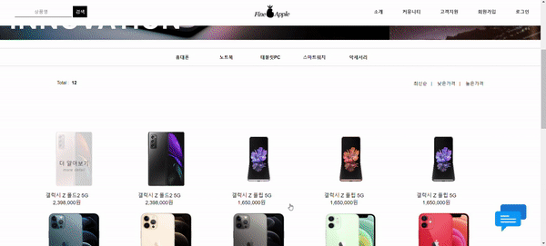

- 상품정렬은 최신순, 낮은가격순, 높은 가격 순으로 하였다
  - 아쉬운점은 카테고리별로 구분하지는 못했다는 점
      

## 2.1.6. 공지 팝업창

- 메인들어갔을 때 가장 먼저 떠야함

- 인터넷창이 안뜨는 깔끔한 레이어팝업

- 팝업이 떴을 때는 메인홈페이지의 화면을 약간 어둡게

- 쿠키를 사용하여 오늘하루보지않기를 누르면 새로고침을 해도 안 뜨게
      

 
## 2.2.1. 로그인

-   로그인버튼을 누르면 로그인창으로 이동한다

-   로그인이 성공했을 때는 로그인버튼이 로그아웃으로 바뀌며 회원가입부분은 마이룸으로 바뀐다

-   로그아웃할 때는 이렇게 확인창이 뜨고 확인을 누르면 로그아웃이 된다
      

## 2.2.2. 로그아웃

- 로그아웃할 때는 확인창이 뜨고 확인을 누르면 로그아웃이 된다
      

## 2.2.3. 아이디찾기
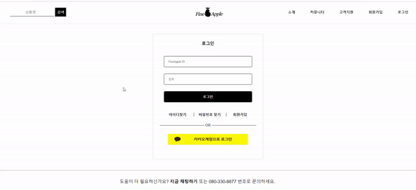

-   로그인페이지에는 아이디찾기와 비밀번호찾기 버튼이 있다

-   아이디찾기를 누르면 휴대폰본인확인 페이지가 뜬다

-   등록된 정보가 없을 때는 없다고 뜬다
-   다시찾기와 회원가입버튼이 있다
-   또한 밑에는 홈페이지광고이미지가 떠서 자연스럽게 프로모션가능하도록 하였다
    -   자세히보면 fineapple로고가 있다 ...ㅎ

-   정보가 있을 경우에는 아래와 같이 아이디가 네모상자 안에 뜨도록 하였다
-   아이디를 찾았으니 바로 로그인 가능하도록 로그인버튼을 아래에 배치하였다  
  
      

- 휴대폰번호를 입력할 때 대쉬가 있는 것이 구분하기편하다  
  하지만 사용자가 사용할때 대쉬를 매번 쓴다는 것은 너무 귀찮은 일이다   
  따라서 폰번호의 형식에 맞게 자동으로 하이픈이 추가되도록 설정하였다
      

## 2.2.4. 비밀번호 찾기
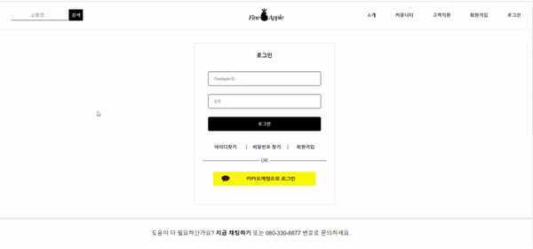

- 비밀번호찾기를 눌렀을 경우 
- 아이디찾기를 통해 찾은 아이디와 번호로 찾을 수 있다
- 등록한 정보가 없을 때는 아이디찾기화면과 동일하게 등록된 정보가 없다고 뜬다
- 등록한 정보가 있을 때는 비밀번호가 뜬다
  - 보안에는 아주 취약하다
      

## 2.2.5. 카카오로 로그인하기
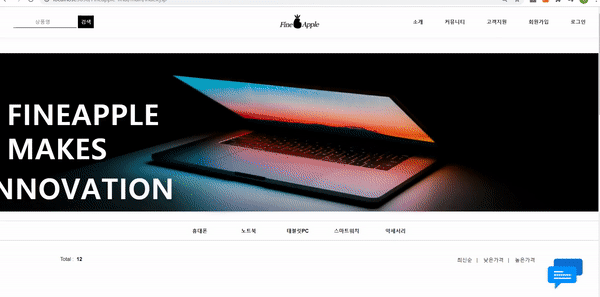

- 카카오 로그인 API를 써서 간단하게 로그인을 할 수 있도록 했다

    

## 2.3.1. 카카오페이 API로 결제하기
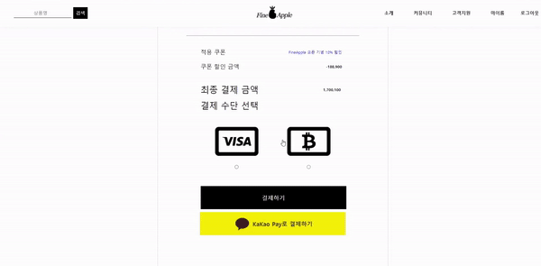

- 구매부분은 다른 팀원의 부분이었지만 나는 간단하게 결제되는 카카오페이를 구현하고싶어서 따로 해보았다
- QR코드와 전화번호로 결제 둘 다 가능하다 

    

## 2.3.2. 에디터 API로 글쓰기
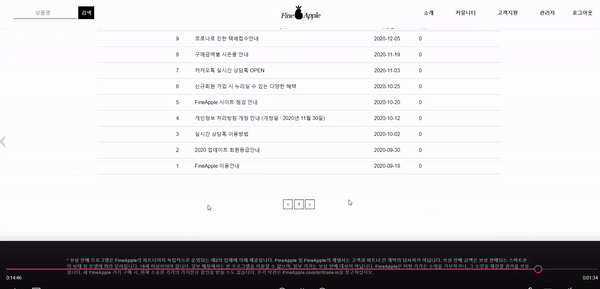

- 공지사항은 모든 고객들이 보는 곳이기 때문에 보다 다양한 글을 쓸 수 있도록 에디터 API를 추가하였다.
    

## 2.3.3. 채팅 API로 실시간 문의하기
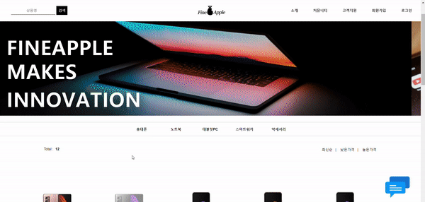

- 메인에서는 스크롤을 내려도 채팅이모티콘은 fix되게끔 하였다
- 로그인부분에서 문제가 있을 시 실시간으로 채팅이 가능하도록 하였다
    

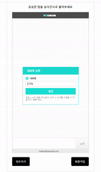

- 모바일로 채팅을 하는 듯한 느낌을 주었다
- 운영자에게 실시간 문의가 가능하다
- 접속해있는 사용자들끼리도 실시간 다중채팅이 가능하다.
    

## 2.4.1. 공지사항 게시판

- 공지사항게시판의 VIEW화면, 검색화면

    

 

- 등록, 삭제화면
  - 등록할 때는 다양한 서식적용이 가능하도록 에디터API를 사용했다
  - 관리자로 로그인하면 입력버튼이 활성화된다
  - 삭제시에는 다시한번 비밀번호를 입력받아 관리자임을 확인한다
    - 아쉬운점 : 비밀번호암호화를 했어야했다
    

## 2.4.2. 이벤트 게시판

- 이미지로만 되어있는 게시판을 만들고 싶었다
- 마감된 글은 접근이 불가하다
  - 완성하지 못해 아쉬웠다

    

## 2.5. 관리자 페이지
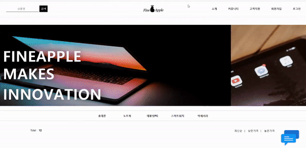

- admin으로 로그인을 하면 관리자페이지가 활성화된다
  - admin은 회원테이블과 별도로 따로 테이블을 생성하였다
- 회원관리, 상품관리, 매출달력을 확인할 수 있다
  - 페이징 부분은 다른 팀원의 도움을 받았다
    

- 공지사항에서 글을 작성할 수 있다
    

## 2.6.1. 로고 이미지

- 쇼핑몰만의 로고가 있어야된다고 생각해서 만들었다
- 애플느낌나는 파인애플로고를 가져왔다
  - 파인애플 그림 출처 : https://cimple.tistory.com/324

    

## 2.6.2. 광고 이미지
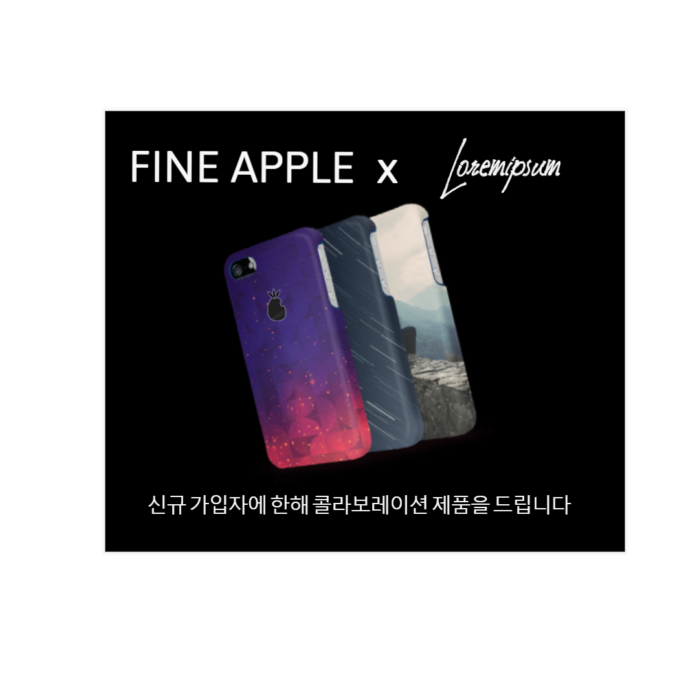

- 회원가입을 장려하도록 광고이미지를 만들었다
- 이 광고는 아이디나 비밀번호를 찾지 못했을 때 하단에 배치하였다