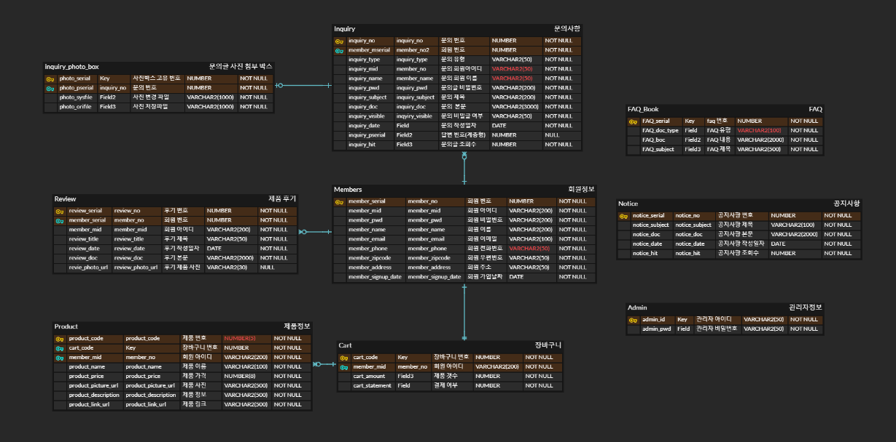
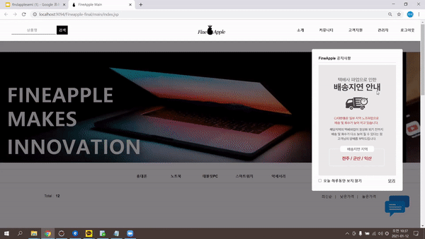
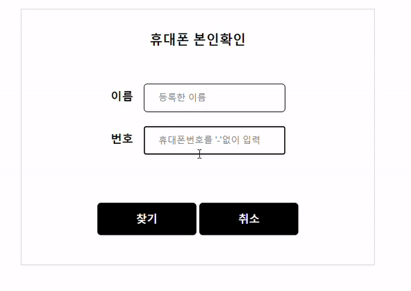

# 목차

- [목차](#목차)
- [1. 프로젝트 설명](#1-프로젝트-설명)
  - [1.1. 프로젝트 기간](#11-프로젝트-기간)
  - [1.2. 프로젝트 명](#12-프로젝트-명)
  - [1.3. 프로젝트 인원](#13-프로젝트-인원)
  - [1.4. 주제 선정 이유](#14-주제-선정-이유)
  - [1.5. 차별성](#15-차별성)
  - [1.6. 개발환경](#16-개발환경)
  - [1.7. ERD 모델](#17-erd-모델)
  - [1.8. 내가 맡은 부분](#18-내가-맡은-부분)
  - [1.9. 세미 프로젝트 후기](#19-세미-프로젝트-후기)
- [2. 프로젝트 시연](#2-프로젝트-시연)
  - [2.1.1 메인페이지](#211-메인페이지)
  - [2.1.2. 헤더](#212-헤더)
  - [2.1.3. 상품 진열](#213-상품-진열)
  - [2.1.4. 상품 검색](#214-상품-검색)
  - [2.1.5. 상품 정렬](#215-상품-정렬)
  - [2.1.6. 공지 팝업창](#216-공지-팝업창)
  - [2.2.1. 로그인](#221-로그인)
  - [2.2.2. 로그아웃](#222-로그아웃)
  - [2.2.3. 아이디찾기](#223-아이디찾기)
  - [2.2.4. 비밀번호 찾기](#224-비밀번호-찾기)
  - [2.2.5. 카카오로 로그인하기](#225-카카오로-로그인하기)
  - [2.3.1. 카카오페이 API로 결제하기](#231-카카오페이-api로-결제하기)
  - [2.3.2. 에디터 API로 글쓰기](#232-에디터-api로-글쓰기)
  - [2.3.3. 채팅 API로 실시간 문의하기](#233-채팅-api로-실시간-문의하기)
  - [2.4.1. 공지사항 게시판](#241-공지사항-게시판)
  - [2.4.2. 이벤트 게시판](#242-이벤트-게시판)
  - [2.5. 관리자 페이지](#25-관리자-페이지)

# 1. 프로젝트 설명
## 1.1. 프로젝트 기간  
 2020.12.01~ 2020.01.12
   

## 1.2. 프로젝트 명 
FineApple (전자제품 판매쇼핑몰)
   

## 1.3. 프로젝트 인원 
6명
   

## 1.4. 주제 선정 이유 
팀원들 대부분이 가장 무난하고도 배운 내용을 복습할 수 있는 프로젝트는 쇼핑몰이라고 생각했다. 쇼핑몰은 무난하지만 기능을 얼마나 추가하냐에 따라서 난이도가 높아질 수도 있기때문에 최소기능 구현 후에는 추가작업을 하려고 했다
   

## 1.5. 차별성
- 가독성과 접근성
    - 쇼핑몰에서 상품의 질과 가격도 중요하지만 접근성과 가독성도 무척 중요하다. 따라서 직관적이고 심플한 UI/UX를 구축하였고 다양한 기능들을 추가했다.   
  `헤더에 상품 검색 기능, 사이트 맵, 메뉴 드롭다운 시 서브메뉴, 게시판 마다 있는 바로가기키`
    
- 커뮤니케이션
  - 고객과의 소통을 중요시하며 단방향이 아닌 양방향성의 의사소통을 할 수 있도록 하였다  
  `실시간 문의, 다양한 커뮤니티 게시판`

- 편리성
  - 간단하고 편리하게 시스템을 이용할 수 있는 기능들을 추가했다  
  `카카오페이 API, 카카오 로그인 API, 에디터 API`

   
 
## 1.6. 개발환경
- Language : Java
- DBMS : Oracle11g
- Prontend : HTML, CSS, javascript, jstp/servlet
- Library : Jquery, ojdbc, mybatis, JSTL, cos
- Framework : MyBatis
- Server : Apache Tomca 9.0
- Control : GitHub, SourceTree
- IDE : Eclipse, SQL Developer, VS Code

   

## 1.7. ERD 모델

  
  

## 1.8. 내가 맡은 부분
메인페이지, 로고디자인, 상품진열/검색/정렬, 로그인, 아이디/비밀번호 찾기, 공지 팝업창, 이벤트게시판, 공지게시판 등록/검색/삭제, 실시간 채팅, 에디터API, 카카오 로그인 API, 카카오 결제 API, DB모델링 및 연동, 관리자 페이지 구축, PPT제작 등

   

## 1.9. 세미 프로젝트 후기
어쩌구

      

# 2. 프로젝트 시연

## 2.1.1 메인페이지

-  헤더: 검색, 로고, 메뉴에 댔을 때 서브메뉴 드롭다운
-  메인이미지 슬라이드
-  메인문구 슬라이드
-  카테고리별 Ajax로 상품진열, 상품정렬
-  푸터: 사이트맵
-  채팅API로 바로 문의 가능
      

## 2.1.2. 헤더

-   로그인 전, 회원가입과 로그인이 뜨도록

-   로그인 후, 마이룸과 로그아웃이 뜨도록

-   관리자 로그인 후, 관리자페이지와 로그아웃 뜨도록

-   메뉴 드롭다운 시 서브메뉴 나오도록

-   헤더는 픽스가 가능하도록 설정
    -   스크롤을 내려도 헤더는 고정되어있다
      

## 2.1.3. 상품 진열

      

## 2.1.4. 상품 검색

      

## 2.1.5. 상품 정렬

- 상품정렬은 최신순, 낮은가격순, 높은 가격 순으로 하였다
  - 아쉬운점은 카테고리별로 구분하지는 못했다는 점
      

## 2.1.6. 공지 팝업창

- 메인들어갔을 때 가장 먼저 떠야함

- 인터넷창이 안뜨는 깔끔한 레이어팝업

- 팝업이 떴을 때는 메인홈페이지의 화면을 약간 어둡게

- 쿠키를 사용하여 오늘하루보지않기를 누르면 새로고침을 해도 안 뜨게
      

 
## 2.2.1. 로그인
-   로그인버튼을 누르면 로그인창으로 이동한다

-   로그인이 성공했을 때는 로그인버튼이 로그아웃으로 바뀌며 회원가입부분은 마이룸으로 바뀐다

-   로그아웃할 때는 이렇게 확인창이 뜨고 확인을 누르면 로그아웃이 된다
      

## 2.2.2. 로그아웃
- 로그아웃할 때는 확인창이 뜨고 확인을 누르면 로그아웃이 된다
      

## 2.2.3. 아이디찾기
-   로그인페이지에는 아이디찾기와 비밀번호찾기 버튼이 있다

-   아이디찾기를 누르면 휴대폰본인확인 페이지가 뜬다

-   등록된 정보가 없을 때는 없다고 뜬다
-   다시찾기와 회원가입버튼이 있다
-   또한 밑에는 홈페이지광고이미지가 떠서 자연스럽게 프로모션가능하도록 하였다
    -   자세히보면 fineapple로고가 있다 ...ㅎ

-   정보가 있을 경우에는 아래와 같이 아이디가 네모상자 안에 뜨도록 하였다
-   아이디를 찾았으니 바로 로그인 가능하도록 로그인버튼을 아래에 배치하였다  
  

- 휴대폰번호를 입력할 때 대쉬가 있는 것이 구분하기편하다  
  하지만 사용자가 사용할때 대쉬를 매번 쓴다는 것은 너무 귀찮은 일이다   
  따라서 폰번호의 형식에 맞게 자동으로 하이픈이 추가되도록 설정하였다
      

## 2.2.4. 비밀번호 찾기
- 비밀번호찾기를 눌렀을 경우 
- 아이디찾기를 통해 찾은 아이디와 번호로 찾을 수 있다
- 등록한 정보가 없을 때는 아이디찾기화면과 동일하게 등록된 정보가 없다고 뜬다
- 등록한 정보가 있을 때는 비밀번호가 뜬다
  - 보안에는 아주 취약하다
      

## 2.2.5. 카카오로 로그인하기
    

## 2.3.1. 카카오페이 API로 결제하기

- 구매부분은 다른 팀원의 부분이었지만 나는 간단하게 결제되는 카카오페이를 구현하고싶어서 따로 해보았다
- QR코드와 전화번호로 결제 둘 다 가능하다 

    

## 2.3.2. 에디터 API로 글쓰기

- 공지사항은 모든 고객들이 보는 곳이기 때문에 보다 다양한 글을 쓸 수 있도록 에디터 API를 추가하였다.
    

## 2.3.3. 채팅 API로 실시간 문의하기

- 메인에서는 스크롤을 내려도 채팅이모티콘은 fix되게끔 하였다
- 로그인부분에서 문제가 있을 시 실시간으로 채팅이 가능하도록 하였다
    

## 2.4.1. 공지사항 게시판

- 공지사항게시판의 VIEW화면, 검색화면

    

 

- 등록, 삭제화면
  - 등록할 때는 다양한 서식적용이 가능하도록 에디터API를 사용했다
  - 관리자로 로그인하면 입력버튼이 활성화된다
  - 삭제시에는 다시한번 비밀번호를 입력받아 관리자임을 확인한다
    - 아쉬운점 : 비밀번호암호화를 했어야했다
    

## 2.4.2. 이벤트 게시판
    

## 2.5. 관리자 페이지

- admin으로 로그인을 하면 관리자페이지가 활성화된다
  - admin은 회원테이블과 별도로 따로 테이블을 생성하였다
- 회원관리, 상품관리, 매출달력을 확인할 수 있다
  - 페이징 부분은 다른 팀원의 도움을 받았다
    

- 공지사항에서 글을 작성할 수 있다